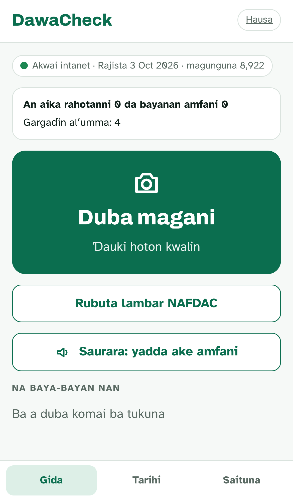
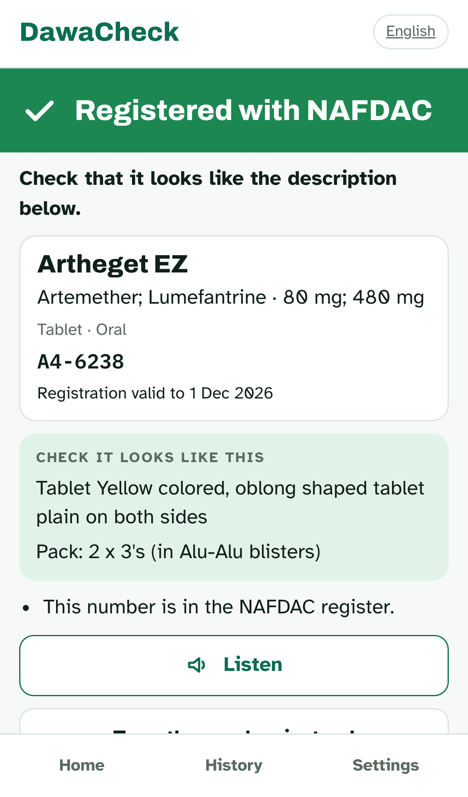
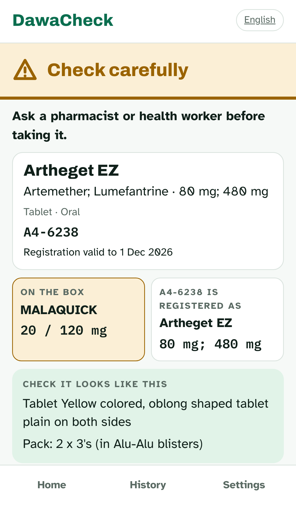
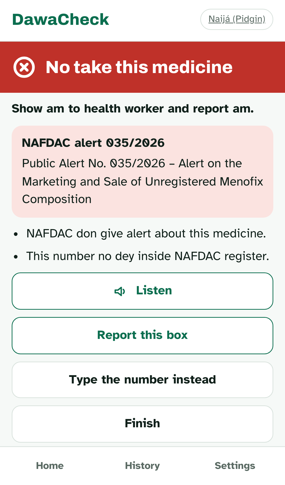
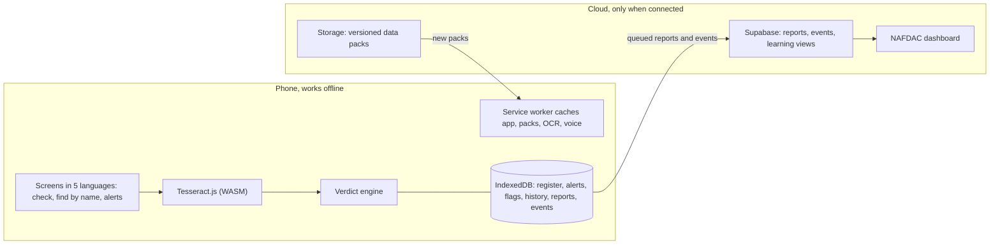

# DawaCheck

Check a medicine against Nigeria's NAFDAC register with no internet. Photograph the box, and the phone reads the NAFDAC number, checks it against the full register and NAFDAC's public alerts, and gives the verdict in Hausa, English or Pidgin.

World Bank "Small AI for Development" hackathon, Health track.

<p>
  
  
  
  
</p>

- **Live app:** https://dawacheck-smoky.vercel.app (install it from Safari or Chrome with "Add to Home Screen", then it works in airplane mode)
- **Demo cartons to scan:** https://dawacheck-smoky.vercel.app/#/demo-packs
- **Regulator dashboard:** https://dawacheck-smoky.vercel.app/#/dashboard (live from Supabase: reports and checks synced from phones)
- **Design:** https://claude.ai/artifact/Q392hGkC2QW5h8SNR8HHpv
- **Pitch deck:** https://claude.ai/artifact/VFmE5yFdgihQEJL9oXrimJ (exports to .pptx or PDF; source text in `docs/pitch.md`)
- **Videos:** three 60-second submission videos (team, demo, tech) built from the live app, ElevenLabs narration and Higgsfield scenes; see `docs/videos.md`. Longer demo script: `docs/video-script.md`

## Why

- About 1 in 10 medical products in low- and middle-income countries is substandard or falsified (WHO).
- WHO-commissioned models attribute up to 169,000 child pneumonia deaths a year to bad antibiotics.
- 75% of rural Nigerians first go to a patent medicine vendor, a shop without a pharmacist. Antimalarials and antibiotics are the most common purchases.
- 2.2 billion people are offline (ITU 2025). Connectivity and doctors are scarcest where fake medicine does the most harm.

## What it does

1. **Read the box on the phone.** Take a photo, or type the number. Tesseract OCR runs in the browser with no server, and pulls out the NAFDAC number, batch, expiry date, name and strength. A sideways photo is turned and read again.
2. **Check it offline** against the NAFDAC Greenbook register (8,922 products) and 84 NAFDAC public alerts, all stored on the phone. When the number is unreadable, **find the medicine by name** (brand, ingredient or part of the number) and compare the box with what NAFDAC registered. Vendors and health workers can **browse and search every NAFDAC alert** offline.
3. **Verdict:**
   - **Registered with NAFDAC** (green). The app also shows NAFDAC's own description of the registered tablet and pack so the user can compare.
   - **Check carefully** (amber). Covers a copied number, the wrong strength, a lapsed registration, a NAFDAC warning about the brand, or reports from other users.
   - **Do not take this medicine** (red). Covers a number not in the register, a product or batch named in a NAFDAC alert, or an expired pack.
4. **Local languages and voice.** Screen text is in Hausa, English and Nigerian Pidgin, with full Yoruba and Igbo drafts. Every verdict has a recorded voice clip in Hausa, English and Pidgin (ElevenLabs `eleven_v3`, 42 clips, stored on the phone and played with no internet). If a clip is missing, English and Pidgin fall back to the phone's own offline voice.
5. **Report and sync.** Reports and opt-in anonymous usage events wait on the phone. They upload when any connection appears: on app start, when the network returns, or every 5 minutes. An optional "Send by SMS" button works on a weak signal.
6. **It learns.**
   - When several phones report the same number, it becomes a community flag on every phone.
   - User corrections of misread numbers tune the matcher.
   - Numbers that keep appearing but aren't in the register are exported for NAFDAC.
   - New register and alert packs download automatically, with sha256 checks.
7. **Built for the people who use it.** Every verdict uses colour, an icon, a short title and voice, for people who read little. The page language follows the app language for screen readers, tap targets are at least 48 px, and an automated accessibility check (axe) runs on the main screens. The app asks the browser to keep its offline data, and shows iPhone users how to add it to the home screen.

## What works today

Everything below runs on the live app:

- Offline checks against 8,922 products and 84 NAFDAC alerts, with brands and 307 batch numbers extracted by Claude.
- On-device OCR, including sideways photos; find by name; the NAFDAC alerts list.
- Recorded voice in Hausa, English and Pidgin.
- Reports saved offline, with an SMS backup, then synced to Supabase: community flags, OCR corrections and fresher data packs come back down. The phone ships with a register 12 products behind, so the first sync shows a real pack update (8,910 → 8,922).
- The regulator dashboard reads live aggregate views. Built without a backend, it shows labelled example data instead.

Optional: BrightData fetching (`npm run data:alerts -- --via=brightdata`) needs a Web Unlocker zone in `BRIGHTDATA_ZONE`; the direct NAFDAC fetch is used otherwise.

## Small AI in numbers

| Part | Size |
|---|---|
| Whole offline app (everything cached on the phone) | **19.0 MB** |
| NAFDAC register pack (8,922 products) | 4.8 MB |
| NAFDAC alerts pack (84 alerts) | 0.1 MB |
| On-device OCR (two engine builds for old and new phones, plus the 3 MB English model) | 10.9 MB |
| Voice clips (42: Hausa, English, Pidgin) | 2.2 MB |
| App code | 0.5 MB |

Measured with `npm run sizes`. Reading a demo carton takes about 1.5 s in the browser. No GPU, no cloud and no per-check cost: verdicts never touch the network.

## How the verdict works

- Every rule is pure TypeScript in `src/core` and is covered by table tests.
- Key rule: a misread number is only auto-corrected to a nearby real number when the box's **brand** words confirm it. A fake number therefore can't be "corrected" into a real product.
- Alert matching ignores generic ingredient words such as "artemether", using the register's ingredient vocabulary. One alert about one brand won't flag every artemether box.



## Run it

```bash
npm install
npm run dev          # http://localhost:5173
npm run verify       # typecheck + 219 unit tests + build + 20 end-to-end tests (Chromium + iPhone WebKit: offline, accessibility, sideways photo)
npm run test:ocr     # real OCR on the demo carton images
```

A clean clone builds with no keys: `npm ci && npm run build` (the data packs are committed; OCR files are copied from `node_modules`).

Data and assets:
- `npm run data` (register, alerts, manifest)
- `npm run voice` (needs `ELEVENLABS_API_KEY`)
- `npm run fixtures`
- `npm run icons`

Backend (optional; the app works without it):
1. Create a Supabase project and run `supabase/schema.sql` in its SQL editor.
2. Fill `.env` from `.env.example`.
3. Run `npm run check:backend`, then `npm run publish-packs`, then `npm run deploy`.

## Data sources

- **NAFDAC Greenbook:** the public register JSON, fetched 3 Oct 2026 (`npm run data:register`).
- **NAFDAC public alerts:** through the NAFDAC WordPress REST API. Facts are extracted with Claude (`claude-opus-5`, structured outputs) when `ANTHROPIC_API_KEY` is set, and from alert titles otherwise. BrightData Web Unlocker fetch is supported with `--via=brightdata`.
- **Voices:** ElevenLabs `eleven_v3`, pre-rendered at build time.

## Privacy and safety

- No names, phone numbers or GPS. The user picks their state. Usage sharing is opt-in and off by default. The device ID is random.
- Phones can only insert into the backend. Only aggregate views are readable.
- Designed to fit Nigeria's Data Protection Act 2023.

DawaCheck checks NAFDAC records and what is printed on the box. It cannot test what is inside. If in doubt, do not take it and ask a health worker.

## Limits and next steps

- Registration checks catch unregistered, expired, recalled and mismatched boxes. A perfect copy with a real number needs community reports and lab follow-up.
- Device ids are random and made on the phone, so they are not identities. The backend caps each device at 20 reports and 2,000 usage events a day, which slows spam but cannot stop a determined attacker. Community flags need reports from several devices, and NAFDAC should review them before acting.
- Hausa, Pidgin, Yoruba and Igbo text are drafts for native-speaker review.
- Next steps:
  - Native Android app with ML Kit OCR.
  - Kenya PPB and Ghana FDA registers in the same pack format.
  - A NAFDAC SMS shortcode for reports.
  - Pharmacist-reviewed "how to take" cards.
